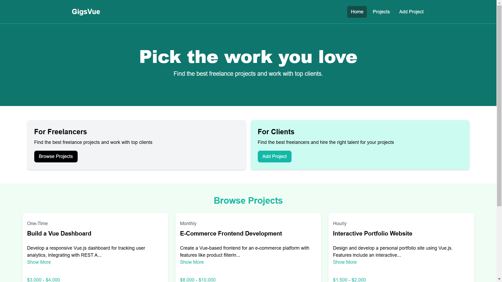

# GigsVue - A Freelance Job Hunting and Posting Platform

GigsVue is a freelance job hunting and posting platform built using Vue.js. It allows users to post and view freelance jobs. The platform is built using Vue.js, Vue Router, and JSON Server as the mock backend. It is built while learning and Vue.js and covers most of the basic concepts of Vue.js including CRUD operations, routing, and some state management.

## Live Preview

Please visit [GigsVue - Live](https://cardzire-dk.netlify.app) to see the site's live preview.



## Installation

1.  Clone the repository:

    ```bash
    git clone https://github.com/yodkwtf/gigsvue-with-vuejs
    ```

2.  Navigate to the project directory:

    ```bash
    cd gigsvue-with-vuejs
    ```

3.  Install the dependencies:

    ```bash
    npm install
    ```

4.  Start the development servers:

    ###### Start the JSON Server:

    ```bash
    npm run server
    ```

    ###### Start the Vue.js development server:

    ```bash
    npm run dev
    ```

5.  Open the browser and navigate to `http://localhost:3000/` to view the application.

## Contributing

Contributions are welcome! Please fork the repository and submit a pull request for any updates.

## Contact

- **Email:** [48durgesh.kumar@gmail.com](mailto:48durgesh.kumar@gmail.com)
- **LinkedIn:** [Durgesh Chaudhary](https://www.linkedin.com/in/durgesh-chaudhary/)
- **GitHub:** [@yodkwtf](https://github.com/yodkwtf)
